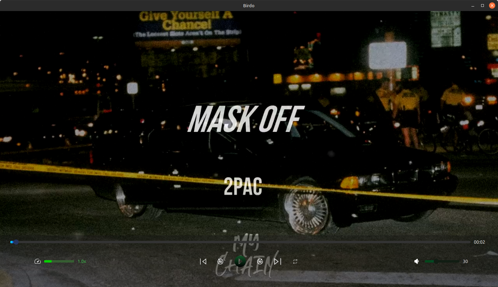
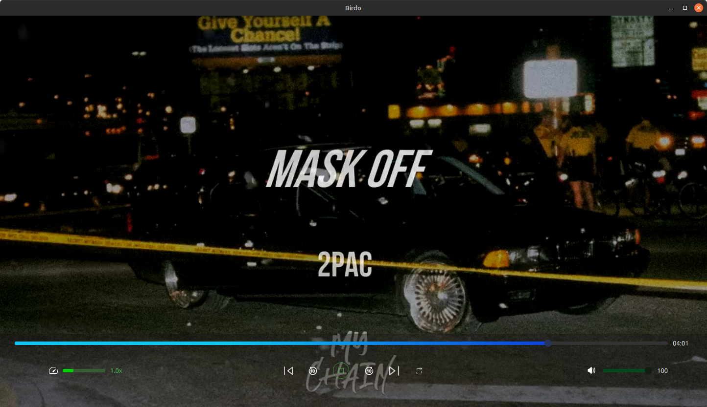
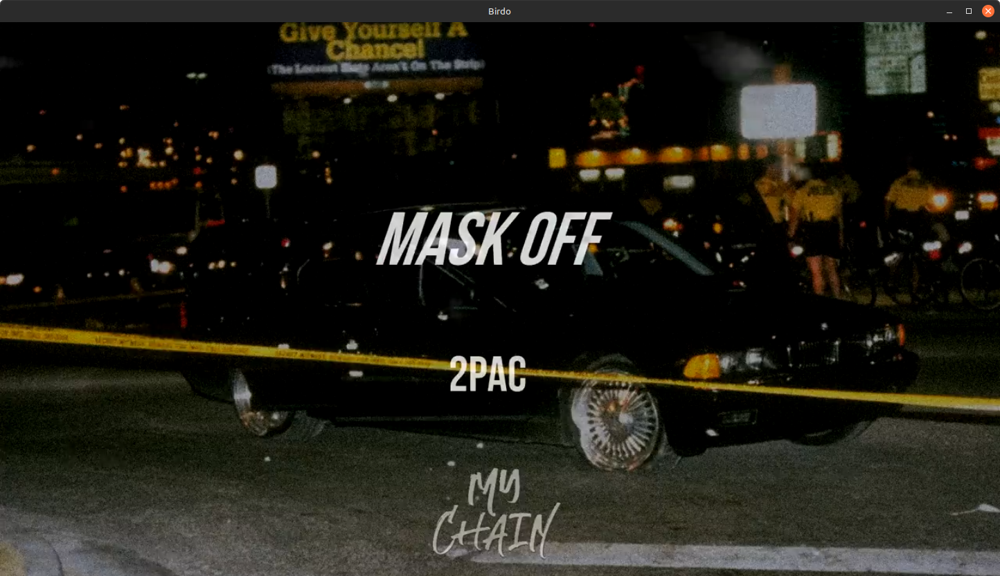

# Birdo
## _Mediaplayer application_
Birdo is a Mediaplayer application. local videos player plays videos from your computer.

## Features
- Birdo saves settings such as volume leve, playlist items, etc...
- Very easy to use - Add a bunch of videos from your computer, and that's it Birdo will play it.
- Loud volume, increasing the volume to 100 will have a louder sound compared to other video players.

## Links

[Twitter (X)](https://twitter.com/Shehab_Ahmed05)
[Telegram](https://t.me/ShehabGuii)

## Tech

Birdo uses several open-source projects to work:

- [Qt](https://www.qt.io/)

## Development

It is a personal project, But feel free to contribute.

## Building source
## Required tools for building the appliaction on windows

1. First you need **Qt 6.5.3** (Tested version, You can use another version and see if it works). You can download Qt for windows, linux from here:
- [Qt online installer](https://www.qt.io/download-open-source)

2. Install CMake if it's not already installed. Recommended CMake version is 3.25, Install CMake from [here](https://cmake.org/download/)

### Required Qt modules to be installed:

- Qt Shader Tools
- Qt Network
- Qt Multimedia

## How to build the project
If you are using **QtCreator IDE** or **Visual studio** you can directly open the **CMakeLists.txt** file and configure the project with the desired Qt Version

## LICENSE

GPL v3.0
